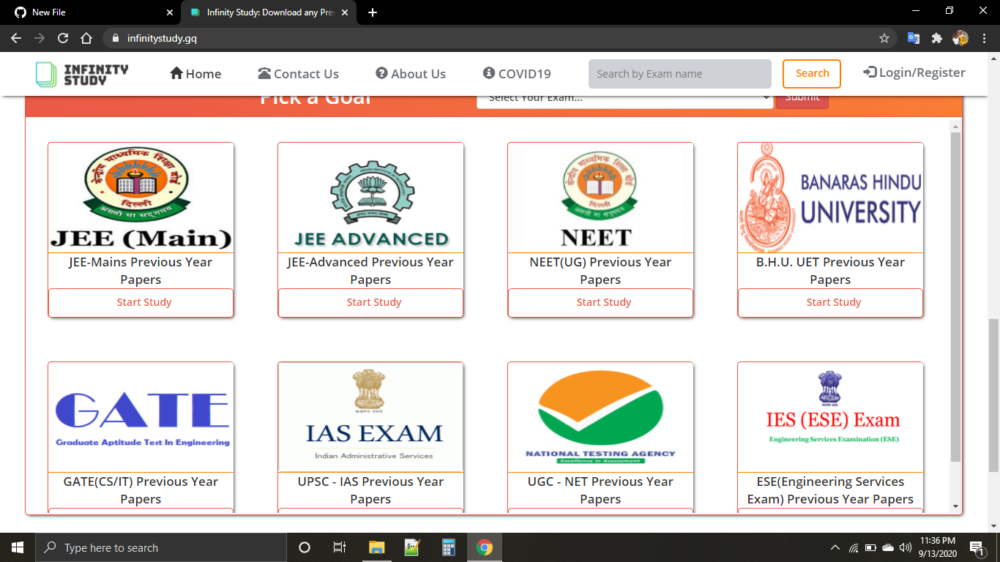
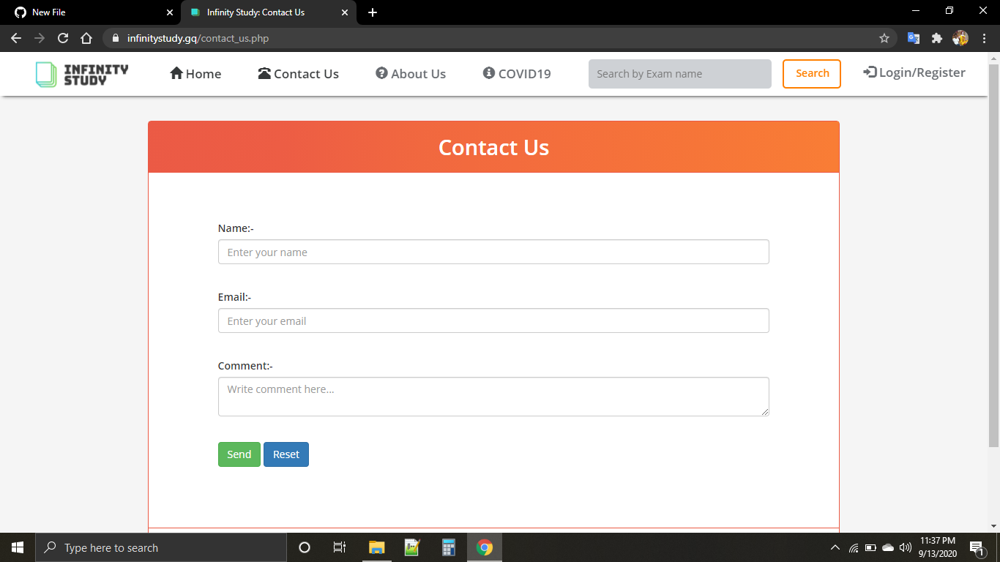
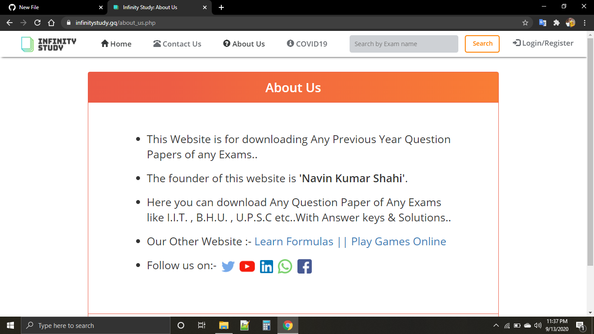
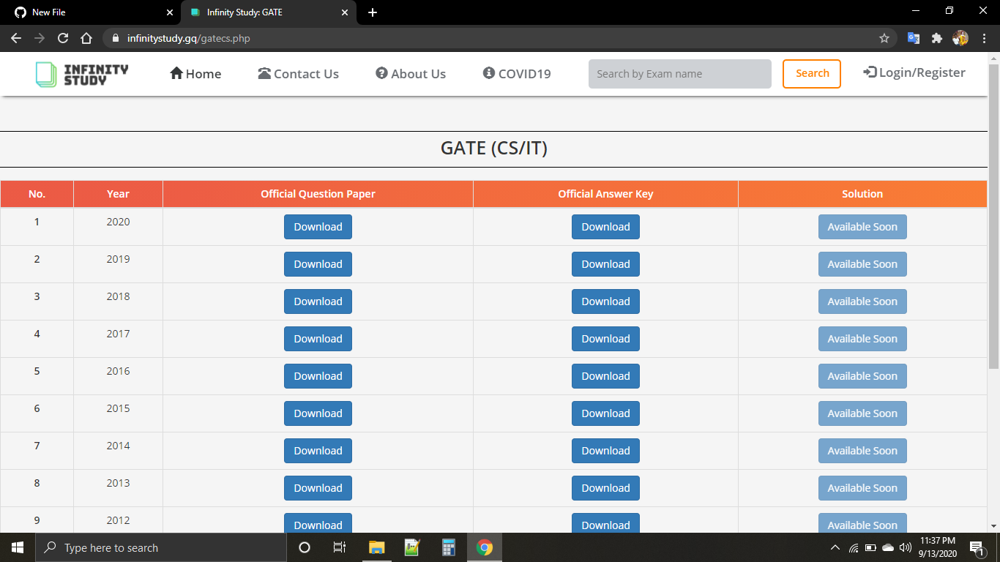

<h1>Infinity Study Website</h1>
<h2>Introduction:-</h2>
This is infinitystudy website created with HTML, CSS & JS .....Here you can download previous year question paper with solution..
<h2>Website link:-</h2>
<a href="https://infinitystudy.gq" target="_blank">Infinity Study</a>
<h2>Screenshots:-</h2>

